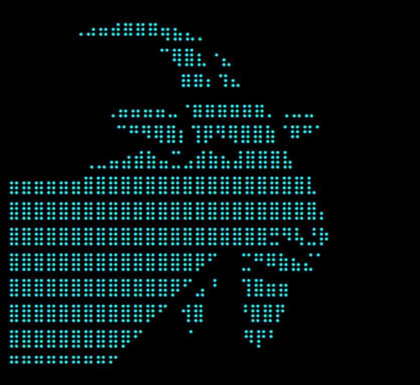

<b>FurbeLang</b>  
Furbe Lang, Furkan Tokac'ın Simpletron dilini taban olarak kullanan programlama dilidir. 2022 yılında Leafyet'in alt organizasyonu olan Furbe'de geliştirilmiştir. 

Furbe alt organizasyonunun kapanmasının ardından bir daha güncelleme getirilmemiştir. 
